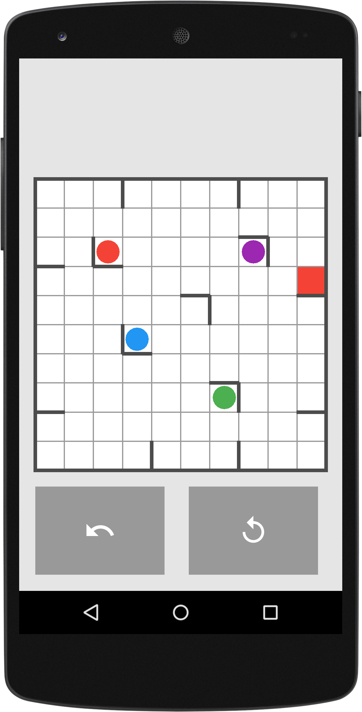

# dot-bot

Multi-platform puzzle game based off of the ideas from Richochet Robots.

Written in LibGDX, compatible with Android, iPhone, and Web. Installation currently complicated. Tested thoroughly on Android.

Screenshot of the game:

